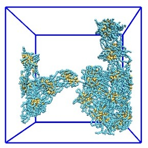

# Varying Charge Density  
### Triblock Polyelectrolytes (PECs) 
##### Bead Types:   
_1_ - Hydrophobic bead (gold)    
_2_ - Charged hydrophilic/PEC bead (blue)    
_3_ - Uncharged PEC bead (red)  
_4_ - Water/fluid bead (purple)  
##### Parameters:
$$$N\_{b}$$$ -- Hydrophobic degree of polymerization per block, AKA block length   
$$$N\_{a}$$$ -- PEC block length   
$$$\delta$$$ ---- PEC block charge density  
$$$l$$$ ----- Box length  
$$$a\_{i,j}$$$ -- DPD repulsive constant between bead type _i_ and _j_  
$$$\rho$$$ ---- Polymer volume fraction

$$a_{i,j}$$  | **1** | **2** | **3** | **4**
--- | --- | --- | --- | ---
 **1** | 25.0 | 90.0 | 90.0 | 100.0
 **2** | 90.0 | **_50.0_** | 25.0 | 26.0
 **3** | 90.0 | 25.0 | 25.0 | 26.0
 **4** | 100.0 | 26.0 | 26.0 | 25.0   

* Vary $$$a_{2,2}$$$ to implicitly represent ionic strength.  
* Varying charge density can be used to represent different types of polyelectrolytes.   

**Fixed:**     

$$$N\_{a} = 30$$$  
$$$N\_{b} = 4$$$   
$$$l = 36.0$$$  
$$$\rho = 0.1$$$    
	
**Variables:** $$$\delta, a\_{2,2}$$$

#### Current Jobs/Objectives
1. **Test**: 
	* Finished on $$$YYGPU_{6}$$$: `/home/whfuss/triblock/vary_charge_test/`  
	* Copied `traj_polymer_1.xyz` to $$$HPC$$$: `/gpfs_partners/yingling/backup/Fuss/triblock/vary_charge/`
	* Parameters:
		+ $$$\delta = $$$ $$$ 1.0 \over 3.0 $$$, $$$ 2.0 \over 3.0 $$$, $$$ 1.0 $$$ 
		+ $$$a\_{2,2} = 50.0$$$  
		+ $$$t = 6000\ frames$$$
	* Initial conditions:   
		  
	* Current snapshots (t = 4000 frames):
		

			<table>
				<tr> 
					<td>$$$\delta = 1.0$$$, PEC (cyan) vs. Phobes (gold)</td>
			 		<td>$$$\delta = $$$ $$$ 2.0 \over 3.0 $$$, PEC (cyan) vs. Phobes (gold):</td> 
			 		<td>$$$\delta = $$$ $$$ 2.0 \over 3.0 $$$, Charged (cyan) vs. Uncharged (red) vs. Phobes (gold):</td>
			 		<td> Phobes (gold) </td> 
			 	</tr>
				<tr> 
					<td>
			 		<td></td> 
			 		<td></td>
			 		<td> </td>
			 	</tr>
			</table>
		
    
		+ $$$a\_{2,2} = 50.0$$$, for the original triblock system, $$$\delta = 1.0$$$, and the $$$\delta = $$$ $$$ 2.0 \over 3.0$$$ triblock system  
 
2. **Processing the Test**: Running the old processing script `test_triblock_linkage.pl` on the `last.xyz`'s (final frames) for **Test** above, using the `yingling` queue on the $$$HPC$$$.  
	* Qualitatively it appears since there are less charged beads, the PEC block is more flexible. Percentage of petal chains, and average aggregation number should increase while percentage of stem chains and number of hydrophobic cores should decrease compared to original triblock, $$$\delta = 1.0$$$.  
	* **Results for 30_50 (so far... t = 4000 frames)**:
	

		<table>
			<tr>
				<td> $$$\delta$$$ </td>
				<td> # of hydrophobic cores </td>
				<td> percentage of stem chains </td>
				<td> percentage of petal chains </td>
				<td> average aggregation number / core </td>
			</tr>
			<tr>
				<td>$$$ 2.0 \over 3.0 $$$</td>
				<td> 2 </td>
				<td> 98.91 </td>
				<td> 0.54 </td>
				<td> 185.00 </td>
			</tr>
			<tr>
				<td> $$$1.0$$$ </td>
				<td> 12 </td>
				<td> 75.82 </td>
				<td> 23.10 </td>
				<td> 37.75 </td>
			</tr>
		</table>
	
     
3. **Next Step**: Rerun **Test** with original neigh_modify delay value (I used 4 instead 3 by mistake) for consistency with previous simulations, and t = 6000 frames to ensure equilibrium. Then run other $$$N\_{a} = 30$$$ with different ionic strengths with $$$\delta = $$$ $$$1.0 \over 3.0$$$, $$$2.0 \over 3.0$$$ on $$$GPU$$$'s.  
 
4. **dpd_cpp**: Continue developing $$$DPD$$$ library and finish new triblock processing program with it. 
 

			